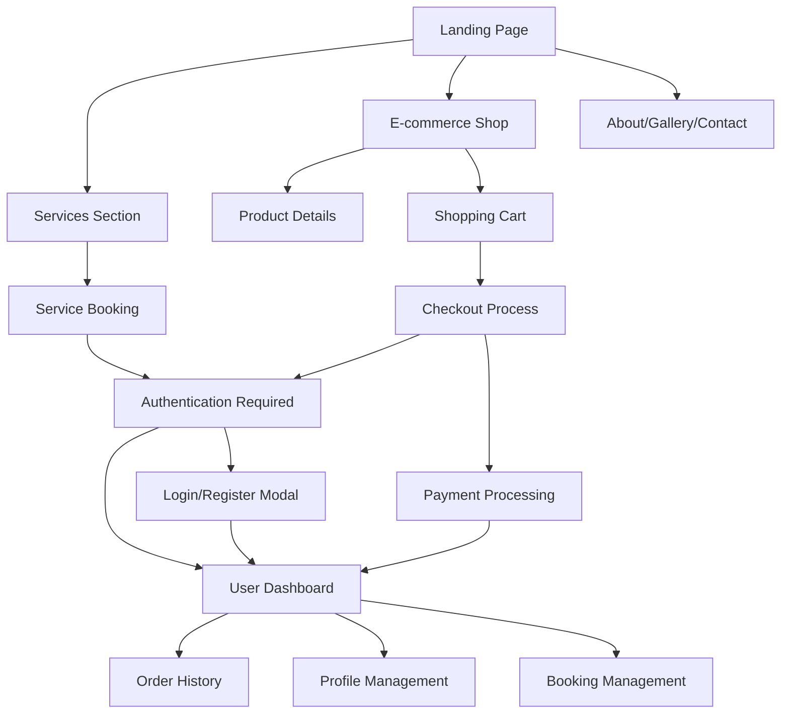

# Product Requirements Document - Pawranger Website

## 1. Product Overview

Pawranger is a comprehensive pet care services platform that combines professional pet services with an integrated e-commerce store. The platform serves pet owners by providing easy access to grooming, veterinary care, pet sitting services, and a complete online shopping experience for pet products.

The website addresses the growing need for convenient, reliable pet care services while offering a seamless shopping experience for pet supplies, targeting busy pet owners who value quality care and convenience.

## 2. Core Features

### 2.1 User Roles

| Role | Registration Method | Core Permissions |
|------|---------------------|------------------|
| Guest User | No registration required | Can browse services and products, view information |
| Registered User | Email registration with phone verification | Can book services, make purchases, manage orders, access dashboard |
| Admin User | Internal system access | Full system management, order processing, content management |

### 2.2 Feature Module

Our Pawranger website consists of the following main pages:

1. **Landing Page**: hero section with service highlights, navigation menu, service overview cards, testimonials, and contact information.
2. **Services Section**: detailed service descriptions, booking system, pricing information, and service provider profiles.
3. **E-commerce Shop**: product catalog with filtering, shopping cart, product details, and category navigation.
4. **User Authentication**: login/register modal, password reset, and account verification.
5. **Checkout System**: multi-step checkout process, payment gateway integration, and order confirmation.
6. **User Dashboard**: order history, booking management, profile settings, and account information.
7. **About/Gallery/Contact**: company information, service gallery, contact forms, and location details.

### 2.3 Page Details

| Page Name | Module Name | Feature description |
|-----------|-------------|---------------------|
| Landing Page | Hero Section | Display main banner with call-to-action buttons, auto-rotating service highlights, responsive design |
| Landing Page | Navigation Header | Responsive navigation menu with dropdown for Info section (About, Gallery, Contact), cart indicator, user authentication status |
| Landing Page | Services Overview | Grid layout of service cards with icons, descriptions, and booking buttons |
| Landing Page | Testimonials | Customer reviews carousel with ratings and feedback |
| Landing Page | Footer | Contact information, social media links, quick navigation, and company details |
| Services Section | Service Booking | Interactive booking form with date/time selection, pet information input, service customization options |
| Services Section | Service Details | Comprehensive service descriptions, pricing tiers, duration estimates, and provider information |
| E-commerce Shop | Product Catalog | Grid/list view toggle, product cards with images, prices, ratings, and quick add-to-cart |
| E-commerce Shop | Filtering System | Category filters, price range slider, rating filters, search functionality with real-time results |
| E-commerce Shop | Shopping Cart | Item management (add/remove/update quantities), price calculations, cart persistence across sessions |
| E-commerce Shop | Product Details | High-resolution image gallery, detailed descriptions, specifications, customer reviews, related products |
| Authentication | Login/Register Modal | Secure user authentication, form validation, password strength indicators, social login options |
| Authentication | Password Management | Password reset via email, secure password change, account recovery options |
| Checkout System | Multi-step Checkout | Order review, shipping information, payment method selection, order confirmation |
| Checkout System | Payment Processing | Bank transfer integration, payment proof upload, payment verification system |
| User Dashboard | Order Management | Order history with status tracking, reorder functionality, order details view, cancellation options |
| User Dashboard | Profile Management | Personal information updates, password changes, address management, communication preferences |
| User Dashboard | Booking History | Service appointment history, rescheduling options, service feedback, upcoming appointments |
| About/Gallery/Contact | Company Information | Mission/vision statements, team profiles, service area coverage, company history |
| About/Gallery/Contact | Image Gallery | Service photos, facility images, pet care examples, before/after galleries |
| About/Gallery/Contact | Contact Forms | Multiple contact methods, inquiry forms, appointment requests, feedback submission |

## 3. Core Process

### Guest User Flow
Guest users can browse the website, view services and products, and access company information. To make purchases or book services, they must register for an account. The registration process is streamlined with email verification and optional phone number confirmation.

### Registered User Flow - Service Booking
Authenticated users can book services by selecting their desired service, choosing available dates and times, providing pet information, and confirming their appointment. They receive email confirmations and can manage bookings through their dashboard.

### Registered User Flow - E-commerce Shopping
Users browse products using filters and search, add items to their cart, proceed through a multi-step checkout process, complete payment via bank transfer, and track their orders through the dashboard.

### Admin Flow
Administrators manage the system through backend interfaces, process orders, verify payments, update content, and handle customer support requests.

## 4. User Interface Design

### 4.1 Design Style

- **Primary Colors**: 
  - Main Brand: #0284c7 (Blue 600)
  - Secondary: #0ea5e9 (Sky 500)
  - Accent: #f59e0b (Amber 500)
- **Button Style**: Rounded corners (rounded-full), gradient backgrounds, hover animations with scale effects
- **Typography**: 
  - Primary Font: Inter or system fonts
  - Headings: Bold weights (font-bold)
  - Body Text: Regular weight (font-normal)
  - Sizes: text-sm to text-4xl responsive scaling
- **Layout Style**: Card-based design with clean spacing, top navigation with dropdown menus, mobile-first responsive approach
- **Icons**: Lucide React icons for consistency, pet-themed illustrations, modern minimalist style

### 4.2 Page Design Overview

| Page Name | Module Name | UI Elements |
|-----------|-------------|-------------|
| Landing Page | Hero Section | Full-width background image, centered content with large typography, gradient overlays, animated call-to-action buttons |
| Landing Page | Navigation | Sticky header with logo, horizontal menu items, dropdown for Info section, cart badge, user avatar/login button |
| Landing Page | Services Cards | 2x2 grid on desktop, single column on mobile, hover effects with shadow elevation, icon + text layout |
| E-commerce Shop | Product Grid | Responsive grid (1-4 columns), product cards with image, title, price, rating stars, add-to-cart button |
| E-commerce Shop | Filter Sidebar | Collapsible on mobile, category checkboxes, price range slider, rating filters, search input with icon |
| Shopping Cart | Cart Modal | Slide-in from right, item list with thumbnails, quantity controls, remove buttons, total calculation, checkout CTA |
| Checkout | Multi-step Form | Progress indicator, form sections with validation, payment method cards, order summary sidebar |
| User Dashboard | Navigation Tabs | Horizontal tab navigation, active state indicators, responsive collapse to dropdown on mobile |
| Authentication | Modal Dialog | Centered overlay, tabbed interface (Login/Register), form validation with error states, social login buttons |

### 4.3 Responsiveness

The product is designed with a mobile-first approach, ensuring optimal experience across all device sizes. Touch interactions are optimized for mobile users, with appropriate button sizes and gesture support. The layout adapts seamlessly from mobile (320px) to desktop (1920px+) with specific breakpoints at 768px (tablet) and 1024px (desktop).

## 5. Technical Requirements

### 5.1 Frontend Technology Stack
- **Framework**: React 18 with Vite build tool
- **Styling**: Tailwind CSS 3 for utility-first styling
- **Icons**: Lucide React for consistent iconography
- **State Management**: React hooks (useState, useEffect) for local state
- **Routing**: React Router for client-side navigation
- **Form Handling**: Controlled components with validation

### 5.2 Backend Services
- **Authentication**: Supabase Auth for user management
- **Database**: Supabase PostgreSQL for data storage
- **File Storage**: Supabase Storage for image uploads
- **API**: RESTful API design with Supabase client SDK

### 5.3 Performance Requirements
- **Page Load Time**: < 3 seconds on 3G connection
- **Lighthouse Score**: > 90 for Performance, Accessibility, SEO
- **Core Web Vitals**: LCP < 2.5s, FID < 100ms, CLS < 0.1
- **Image Optimization**: WebP format with lazy loading
- **Bundle Size**: < 500KB initial JavaScript bundle

### 5.4 Security Requirements
- **HTTPS**: Enforced SSL/TLS encryption
- **Authentication**: Secure password hashing and JWT tokens
- **Input Validation**: Client and server-side validation
- **XSS Protection**: Content Security Policy headers
- **Data Privacy**: GDPR compliance for user data

## 6. Functional Requirements

### 6.1 User Authentication
- User registration with email verification
- Secure login with password requirements
- Password reset functionality
- Session management and auto-logout
- Profile management and updates

### 6.2 Service Booking System
- Real-time availability checking
- Calendar-based date selection
- Time slot management
- Pet information collection
- Booking confirmation and notifications
- Appointment rescheduling and cancellation

### 6.3 E-commerce Functionality
- Product catalog with categories
- Advanced search and filtering
- Shopping cart with persistence
- Multi-step checkout process
- Payment processing integration
- Order tracking and history

### 6.4 Content Management
- Dynamic service information
- Product inventory management
- Image gallery management
- Customer testimonials
- Contact information updates

## 7. Non-Functional Requirements

### 7.1 Usability
- Intuitive navigation structure
- Consistent UI patterns
- Accessibility compliance (WCAG 2.1)
- Multi-language support preparation
- Error handling with user-friendly messages

### 7.2 Reliability
- 99.9% uptime availability
- Graceful error handling
- Data backup and recovery
- Transaction integrity
- Failover mechanisms

### 7.3 Scalability
- Horizontal scaling capability
- CDN integration for global reach
- Database optimization
- Caching strategies
- Load balancing support

### 7.4 Maintainability
- Modular component architecture
- Comprehensive documentation
- Automated testing coverage
- Code quality standards
- Version control and deployment pipelines

## 8. Integration Requirements

### 8.1 Payment Gateway
- Bank transfer processing
- Payment verification system
- Transaction logging
- Refund processing capability
- Multiple payment method support (future)

### 8.2 Communication Services
- Email notifications (booking confirmations, order updates)
- SMS notifications (optional)
- WhatsApp integration for customer support
- Push notifications (future mobile app)

### 8.3 Analytics and Monitoring
- Google Analytics integration
- User behavior tracking
- Performance monitoring
- Error tracking and reporting
- Conversion funnel analysis

## 9. Data Requirements

### 9.1 User Data
- Personal information (name, email, phone)
- Authentication credentials
- Preferences and settings
- Order and booking history
- Payment information (encrypted)

### 9.2 Product Data
- Product catalog with descriptions
- Pricing and inventory information
- Images and media assets
- Categories and tags
- Customer reviews and ratings

### 9.3 Service Data
- Service descriptions and pricing
- Provider information
- Availability schedules
- Booking records
- Customer feedback

### 9.4 Transaction Data
- Order details and status
- Payment records
- Shipping information
- Refund and cancellation records
- Audit trails

## 10. Compliance and Legal

### 10.1 Data Protection
- GDPR compliance for EU users
- Privacy policy implementation
- Cookie consent management
- Data retention policies
- Right to data deletion

### 10.2 Business Compliance
- Terms of service
- Refund and cancellation policies
- Service level agreements
- Liability limitations
- Intellectual property protection

## 11. Success Metrics

### 11.1 Business Metrics
- Monthly active users growth
- Service booking conversion rate
- E-commerce conversion rate
- Average order value
- Customer retention rate

### 11.2 Technical Metrics
- Page load performance
- System uptime
- Error rates
- API response times
- Mobile usage statistics

### 11.3 User Experience Metrics
- User satisfaction scores
- Task completion rates
- Support ticket volume
- Feature adoption rates
- User feedback ratings

## 12. Future Enhancements

### 12.1 Phase 2 Features
- Mobile application development
- Advanced booking system with recurring appointments
- Loyalty program and rewards
- Live chat customer support
- Social media integration

### 12.2 Phase 3 Features
- AI-powered pet care recommendations
- Telemedicine consultations
- Subscription-based services
- Multi-location support
- Advanced analytics dashboard

### 12.3 Long-term Vision
- Marketplace for pet service providers
- Community features and forums
- Pet health tracking integration
- IoT device connectivity
- International expansion capabilities