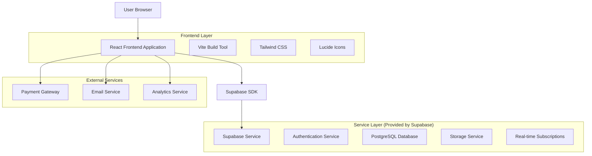
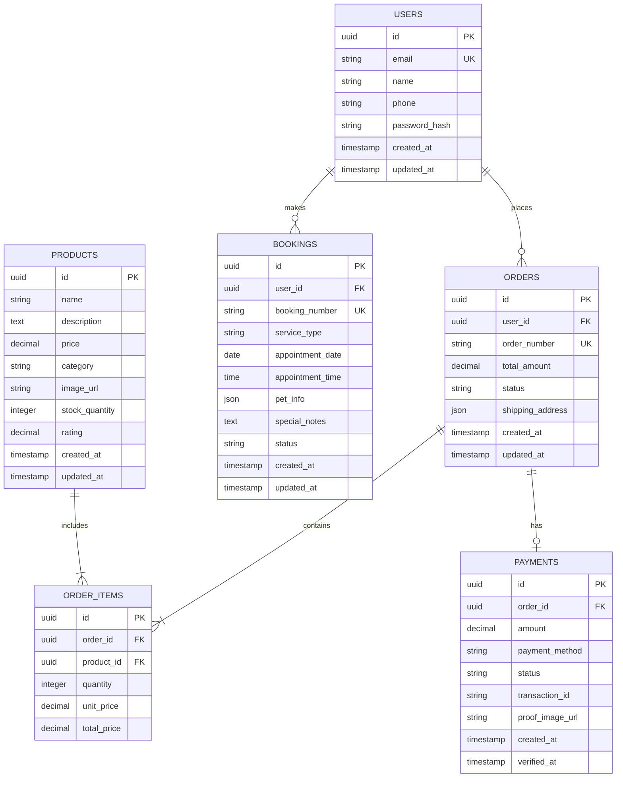

# Technical Architecture Document - Pawranger Website

## 1. Architecture Design



## 2. Technology Description

- **Frontend**: React@18 + Tailwind CSS@3 + Vite@4
- **Backend**: Supabase (Authentication, Database, Storage)
- **Icons**: Lucide React
- **Build Tool**: Vite with ES modules
- **Deployment**: Static hosting (Vercel/Netlify)

## 3. Route Definitions

| Route | Purpose |
|-------|---------|
| / | Landing page with hero section, services overview, and navigation |
| /#services | Services section with booking system and service details |
| /shop | E-commerce page with product catalog, filtering, and cart |
| /checkout | Multi-step checkout process for order completion |
| /dashboard | User dashboard with order history and profile management |
| /#about | About us section with company information |
| /#gallery | Image gallery showcasing services and facilities |
| /#contact | Contact information and inquiry forms |

## 4. API Definitions

### 4.1 Authentication API

**User Registration**
```typescript
POST /auth/v1/signup
```

Request:
| Param Name | Param Type | isRequired | Description |
|------------|------------|------------|-------------|
| email | string | true | User's email address |
| password | string | true | User's password (min 6 characters) |
| name | string | true | User's full name |
| phone | string | false | User's phone number |

Response:
| Param Name | Param Type | Description |
|------------|------------|-------------|
| user | object | User object with id, email, and metadata |
| session | object | Authentication session with access token |

**User Login**
```typescript
POST /auth/v1/token?grant_type=password
```

Request:
| Param Name | Param Type | isRequired | Description |
|------------|------------|------------|-------------|
| email | string | true | User's email address |
| password | string | true | User's password |

Response:
| Param Name | Param Type | Description |
|------------|------------|-------------|
| access_token | string | JWT access token |
| refresh_token | string | Token for refreshing access |
| user | object | User profile information |

### 4.2 E-commerce API

**Get Products**
```typescript
GET /rest/v1/products
```

Query Parameters:
| Param Name | Param Type | isRequired | Description |
|------------|------------|------------|-------------|
| category | string | false | Filter by product category |
| min_price | number | false | Minimum price filter |
| max_price | number | false | Maximum price filter |
| search | string | false | Search term for product name/description |
| limit | number | false | Number of products to return (default: 20) |
| offset | number | false | Pagination offset |

Response:
```json
[
  {
    "id": "uuid",
    "name": "Premium Dog Food",
    "description": "High-quality nutrition for adult dogs",
    "price": 150000,
    "category": "food",
    "image_url": "https://example.com/image.jpg",
    "stock_quantity": 50,
    "rating": 4.5,
    "created_at": "2024-01-01T00:00:00Z"
  }
]
```

**Create Order**
```typescript
POST /rest/v1/orders
```

Request:
| Param Name | Param Type | isRequired | Description |
|------------|------------|------------|-------------|
| user_id | uuid | true | ID of the user placing the order |
| items | array | true | Array of order items with product_id and quantity |
| shipping_address | object | true | Delivery address information |
| total_amount | number | true | Total order amount |

Response:
| Param Name | Param Type | Description |
|------------|------------|-------------|
| id | uuid | Unique order identifier |
| order_number | string | Human-readable order number |
| status | string | Order status (pending, processing, shipped, delivered) |
| created_at | timestamp | Order creation timestamp |

### 4.3 Booking API

**Create Service Booking**
```typescript
POST /rest/v1/bookings
```

Request:
| Param Name | Param Type | isRequired | Description |
|------------|------------|------------|-------------|
| user_id | uuid | true | ID of the user making the booking |
| service_type | string | true | Type of service (grooming, veterinary, sitting, training) |
| appointment_date | date | true | Preferred appointment date |
| appointment_time | time | true | Preferred appointment time |
| pet_info | object | true | Pet information (name, species, breed, age, weight) |
| special_notes | string | false | Additional requirements or notes |

Response:
| Param Name | Param Type | Description |
|------------|------------|-------------|
| id | uuid | Booking identifier |
| booking_number | string | Human-readable booking reference |
| status | string | Booking status (confirmed, pending, cancelled) |
| estimated_duration | number | Service duration in minutes |

## 5. Data Model

### 5.1 Data Model Definition



### 5.2 Data Definition Language

**Users Table**
```sql
-- Create users table (handled by Supabase Auth)
CREATE TABLE public.user_profiles (
    id UUID REFERENCES auth.users(id) PRIMARY KEY,
    name VARCHAR(100) NOT NULL,
    phone VARCHAR(20),
    created_at TIMESTAMP WITH TIME ZONE DEFAULT NOW(),
    updated_at TIMESTAMP WITH TIME ZONE DEFAULT NOW()
);

-- Enable RLS
ALTER TABLE public.user_profiles ENABLE ROW LEVEL SECURITY;

-- Create policies
CREATE POLICY "Users can view own profile" ON public.user_profiles
    FOR SELECT USING (auth.uid() = id);

CREATE POLICY "Users can update own profile" ON public.user_profiles
    FOR UPDATE USING (auth.uid() = id);

-- Grant permissions
GRANT SELECT ON public.user_profiles TO anon;
GRANT ALL PRIVILEGES ON public.user_profiles TO authenticated;
```

**Products Table**
```sql
-- Create products table
CREATE TABLE public.products (
    id UUID PRIMARY KEY DEFAULT gen_random_uuid(),
    name VARCHAR(255) NOT NULL,
    description TEXT,
    price DECIMAL(10,2) NOT NULL,
    category VARCHAR(50) NOT NULL,
    image_url TEXT,
    stock_quantity INTEGER DEFAULT 0,
    rating DECIMAL(3,2) DEFAULT 0,
    created_at TIMESTAMP WITH TIME ZONE DEFAULT NOW(),
    updated_at TIMESTAMP WITH TIME ZONE DEFAULT NOW()
);

-- Create indexes
CREATE INDEX idx_products_category ON public.products(category);
CREATE INDEX idx_products_price ON public.products(price);
CREATE INDEX idx_products_rating ON public.products(rating DESC);
CREATE INDEX idx_products_created_at ON public.products(created_at DESC);

-- Enable RLS
ALTER TABLE public.products ENABLE ROW LEVEL SECURITY;

-- Create policies
CREATE POLICY "Products are viewable by everyone" ON public.products
    FOR SELECT USING (true);

-- Grant permissions
GRANT SELECT ON public.products TO anon;
GRANT ALL PRIVILEGES ON public.products TO authenticated;

-- Insert sample data
INSERT INTO public.products (name, description, price, category, image_url, stock_quantity, rating) VALUES
('Premium Dog Food', 'High-quality nutrition for adult dogs', 150000, 'food', '/images/dog-food-1.jpg', 50, 4.5),
('Cat Toy Mouse', 'Interactive toy for cats', 25000, 'toys', '/images/cat-toy-1.jpg', 100, 4.2),
('Dog Leash', 'Durable nylon leash for dogs', 75000, 'accessories', '/images/dog-leash-1.jpg', 30, 4.8),
('Pet Shampoo', 'Gentle shampoo for sensitive skin', 45000, 'care', '/images/pet-shampoo-1.jpg', 75, 4.3);
```

**Orders Table**
```sql
-- Create orders table
CREATE TABLE public.orders (
    id UUID PRIMARY KEY DEFAULT gen_random_uuid(),
    user_id UUID REFERENCES auth.users(id) NOT NULL,
    order_number VARCHAR(20) UNIQUE NOT NULL,
    total_amount DECIMAL(12,2) NOT NULL,
    status VARCHAR(20) DEFAULT 'pending' CHECK (status IN ('pending', 'processing', 'shipped', 'delivered', 'cancelled')),
    shipping_address JSONB NOT NULL,
    created_at TIMESTAMP WITH TIME ZONE DEFAULT NOW(),
    updated_at TIMESTAMP WITH TIME ZONE DEFAULT NOW()
);

-- Create indexes
CREATE INDEX idx_orders_user_id ON public.orders(user_id);
CREATE INDEX idx_orders_status ON public.orders(status);
CREATE INDEX idx_orders_created_at ON public.orders(created_at DESC);
CREATE UNIQUE INDEX idx_orders_order_number ON public.orders(order_number);

-- Enable RLS
ALTER TABLE public.orders ENABLE ROW LEVEL SECURITY;

-- Create policies
CREATE POLICY "Users can view own orders" ON public.orders
    FOR SELECT USING (auth.uid() = user_id);

CREATE POLICY "Users can create own orders" ON public.orders
    FOR INSERT WITH CHECK (auth.uid() = user_id);

-- Grant permissions
GRANT ALL PRIVILEGES ON public.orders TO authenticated;
```

**Order Items Table**
```sql
-- Create order_items table
CREATE TABLE public.order_items (
    id UUID PRIMARY KEY DEFAULT gen_random_uuid(),
    order_id UUID REFERENCES public.orders(id) ON DELETE CASCADE NOT NULL,
    product_id UUID REFERENCES public.products(id) NOT NULL,
    quantity INTEGER NOT NULL CHECK (quantity > 0),
    unit_price DECIMAL(10,2) NOT NULL,
    total_price DECIMAL(12,2) NOT NULL
);

-- Create indexes
CREATE INDEX idx_order_items_order_id ON public.order_items(order_id);
CREATE INDEX idx_order_items_product_id ON public.order_items(product_id);

-- Enable RLS
ALTER TABLE public.order_items ENABLE ROW LEVEL SECURITY;

-- Create policies
CREATE POLICY "Users can view own order items" ON public.order_items
    FOR SELECT USING (
        EXISTS (
            SELECT 1 FROM public.orders 
            WHERE orders.id = order_items.order_id 
            AND orders.user_id = auth.uid()
        )
    );

CREATE POLICY "Users can create own order items" ON public.order_items
    FOR INSERT WITH CHECK (
        EXISTS (
            SELECT 1 FROM public.orders 
            WHERE orders.id = order_items.order_id 
            AND orders.user_id = auth.uid()
        )
    );

-- Grant permissions
GRANT ALL PRIVILEGES ON public.order_items TO authenticated;
```

**Bookings Table**
```sql
-- Create bookings table
CREATE TABLE public.bookings (
    id UUID PRIMARY KEY DEFAULT gen_random_uuid(),
    user_id UUID REFERENCES auth.users(id) NOT NULL,
    booking_number VARCHAR(20) UNIQUE NOT NULL,
    service_type VARCHAR(50) NOT NULL CHECK (service_type IN ('grooming', 'veterinary', 'sitting', 'training')),
    appointment_date DATE NOT NULL,
    appointment_time TIME NOT NULL,
    pet_info JSONB NOT NULL,
    special_notes TEXT,
    status VARCHAR(20) DEFAULT 'confirmed' CHECK (status IN ('confirmed', 'pending', 'completed', 'cancelled')),
    created_at TIMESTAMP WITH TIME ZONE DEFAULT NOW(),
    updated_at TIMESTAMP WITH TIME ZONE DEFAULT NOW()
);

-- Create indexes
CREATE INDEX idx_bookings_user_id ON public.bookings(user_id);
CREATE INDEX idx_bookings_appointment_date ON public.bookings(appointment_date);
CREATE INDEX idx_bookings_service_type ON public.bookings(service_type);
CREATE INDEX idx_bookings_status ON public.bookings(status);
CREATE UNIQUE INDEX idx_bookings_booking_number ON public.bookings(booking_number);

-- Enable RLS
ALTER TABLE public.bookings ENABLE ROW LEVEL SECURITY;

-- Create policies
CREATE POLICY "Users can view own bookings" ON public.bookings
    FOR SELECT USING (auth.uid() = user_id);

CREATE POLICY "Users can create own bookings" ON public.bookings
    FOR INSERT WITH CHECK (auth.uid() = user_id);

CREATE POLICY "Users can update own bookings" ON public.bookings
    FOR UPDATE USING (auth.uid() = user_id);

-- Grant permissions
GRANT ALL PRIVILEGES ON public.bookings TO authenticated;
```

**Payments Table**
```sql
-- Create payments table
CREATE TABLE public.payments (
    id UUID PRIMARY KEY DEFAULT gen_random_uuid(),
    order_id UUID REFERENCES public.orders(id) ON DELETE CASCADE NOT NULL,
    amount DECIMAL(12,2) NOT NULL,
    payment_method VARCHAR(50) DEFAULT 'bank_transfer',
    status VARCHAR(20) DEFAULT 'pending' CHECK (status IN ('pending', 'verified', 'failed', 'refunded')),
    transaction_id VARCHAR(100),
    proof_image_url TEXT,
    created_at TIMESTAMP WITH TIME ZONE DEFAULT NOW(),
    verified_at TIMESTAMP WITH TIME ZONE
);

-- Create indexes
CREATE INDEX idx_payments_order_id ON public.payments(order_id);
CREATE INDEX idx_payments_status ON public.payments(status);
CREATE INDEX idx_payments_created_at ON public.payments(created_at DESC);

-- Enable RLS
ALTER TABLE public.payments ENABLE ROW LEVEL SECURITY;

-- Create policies
CREATE POLICY "Users can view own payments" ON public.payments
    FOR SELECT USING (
        EXISTS (
            SELECT 1 FROM public.orders 
            WHERE orders.id = payments.order_id 
            AND orders.user_id = auth.uid()
        )
    );

CREATE POLICY "Users can create own payments" ON public.payments
    FOR INSERT WITH CHECK (
        EXISTS (
            SELECT 1 FROM public.orders 
            WHERE orders.id = payments.order_id 
            AND orders.user_id = auth.uid()
        )
    );

-- Grant permissions
GRANT ALL PRIVILEGES ON public.payments TO authenticated;
```

**Database Functions and Triggers**
```sql
-- Function to generate order numbers
CREATE OR REPLACE FUNCTION generate_order_number()
RETURNS TEXT AS $$
DECLARE
    new_number TEXT;
BEGIN
    SELECT 'ORD' || TO_CHAR(NOW(), 'YYYYMMDD') || LPAD((EXTRACT(EPOCH FROM NOW())::BIGINT % 100000)::TEXT, 5, '0')
    INTO new_number;
    RETURN new_number;
END;
$$ LANGUAGE plpgsql;

-- Function to generate booking numbers
CREATE OR REPLACE FUNCTION generate_booking_number()
RETURNS TEXT AS $$
DECLARE
    new_number TEXT;
BEGIN
    SELECT 'BKG' || TO_CHAR(NOW(), 'YYYYMMDD') || LPAD((EXTRACT(EPOCH FROM NOW())::BIGINT % 100000)::TEXT, 5, '0')
    INTO new_number;
    RETURN new_number;
END;
$$ LANGUAGE plpgsql;

-- Trigger to auto-generate order numbers
CREATE OR REPLACE FUNCTION set_order_number()
RETURNS TRIGGER AS $$
BEGIN
    IF NEW.order_number IS NULL THEN
        NEW.order_number := generate_order_number();
    END IF;
    RETURN NEW;
END;
$$ LANGUAGE plpgsql;

CREATE TRIGGER trigger_set_order_number
    BEFORE INSERT ON public.orders
    FOR EACH ROW
    EXECUTE FUNCTION set_order_number();

-- Trigger to auto-generate booking numbers
CREATE OR REPLACE FUNCTION set_booking_number()
RETURNS TRIGGER AS $$
BEGIN
    IF NEW.booking_number IS NULL THEN
        NEW.booking_number := generate_booking_number();
    END IF;
    RETURN NEW;
END;
$$ LANGUAGE plpgsql;

CREATE TRIGGER trigger_set_booking_number
    BEFORE INSERT ON public.bookings
    FOR EACH ROW
    EXECUTE FUNCTION set_booking_number();

-- Function to update timestamps
CREATE OR REPLACE FUNCTION update_updated_at_column()
RETURNS TRIGGER AS $$
BEGIN
    NEW.updated_at = NOW();
    RETURN NEW;
END;
$$ LANGUAGE plpgsql;

-- Apply update triggers to relevant tables
CREATE TRIGGER trigger_update_user_profiles_updated_at
    BEFORE UPDATE ON public.user_profiles
    FOR EACH ROW
    EXECUTE FUNCTION update_updated_at_column();

CREATE TRIGGER trigger_update_products_updated_at
    BEFORE UPDATE ON public.products
    FOR EACH ROW
    EXECUTE FUNCTION update_updated_at_column();

CREATE TRIGGER trigger_update_orders_updated_at
    BEFORE UPDATE ON public.orders
    FOR EACH ROW
    EXECUTE FUNCTION update_updated_at_column();

CREATE TRIGGER trigger_update_bookings_updated_at
    BEFORE UPDATE ON public.bookings
    FOR EACH ROW
    EXECUTE FUNCTION update_updated_at_column();
```